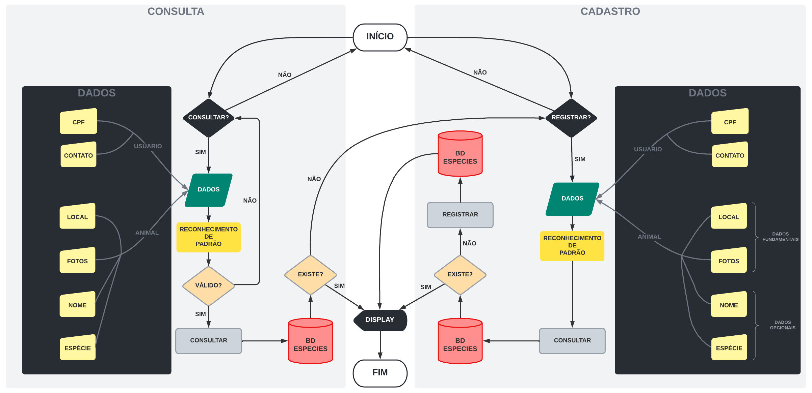

<!--  -->

# **Ocean Shot - 2022**
## *4Tech / ODS 14 - Vida na Água (Desafio Oceanpact)*

### 🙋🏼‍♂️ **Apresentação**

Somos a **4Tech**, um time altamente qualificado de desenvolvimento de soluções tecnológicas para os mais variados tipos de demanda. Nossa principal motivação é estabelecer **facilidade, acessibilidade e qualidade** em serviços digitais que se ampliam para fins humanitários e corporativos. Veja a seguir nosso atual produto em fase de desenvolvimento "**Ocean Shot**" e fique por dentro das possibilidades que oferece.

<!-- Use essa seção para falar sobre as motivações de seu time e, de forma breve, qual o produto que estão trabalhando. Se possível forneça **o que** seu produto é, por exemplo: Um app, uma aplicação web, gadget, dentre outros. -->

### 🌊 **O Ocean Shot**

O Ocean Shot é um **WebApp** que facilita a identificação de vidas marinhas. Ainda em seu protótipo, ele é projetado para o reconhecimento de tartarugas atráves de seus padrões naturais pré-estabelecidos, localizados em suas cabeças. A aplicação inicial já contará com funcionalidades de identificação e pesquisa, são elas:

- 📝 Registrar sua tartaruga
- � Buscar cadastros
- 📲 Acompanhar tartarugas já cadastradas
- 📷 Reconhecimento por fotos

<!-- Adicione detalhes sobre seu produto. Levante pontos positivos, o porquê dele ser inovador, como ele se alinha com o cluster escolhido e quaisquer outras informações relevantes ao entendimento do 'porquê' e 'como' seu produto existe e atua. -->

### ✔️ **Informações adicionais** 

Nós buscamos desenvolver o aplicativo da forma mais **intuitiva e acessível** possível, sendo extremamente **auto-explicativo e de fácil manuseio**. Utilizando a mais recente tecnologia de **reconhecimento de padrões**, conseguimos de forma rápida e precisa fazer a distinção de espécies, identificando também cada tartaruga individualmente, e seus respectivos dados cadastrados.

---
## Como Funciona? 
> **1º Fotografia**
	- Você tira uma foto do animal avistado e faz o upload do arquivo. Assim, o animal será identificado e você saberá seu nome, por onde ele nadou e data das aparições. 

> **2º Registro** 
	- Se o animal ainda não estiver registrado em nossa base de dados, você poderá registrá-lo e dar um nome a ele! 

> **3º Levantamento oceânico** 
	- Você também pode acompanhar os animais que estão próximos a você pode meio de um radar de localização. 

 

## Arquitetura base

 

Arquitetura do sistema utilizando a técnologia o <strong>Amazon Rekognition</strong>.

---

## **_Quem nós somos?_**
	
 ### **José Roberto** 
 ✅ *Desenvolvedor Full-Stack Jr* 
 ☎️ Contatos: 

 

  
  
  
  
  

_"Paciência, disciplina e execução são a chave do mérito."_  

 ### **Gabriel Salustriano** 
 ✅ *Desenvolvedor Full-Stack Jr* 
 ☎️ Contatos: 

  
  
  
  

 _"A vida não é um jogo de sorte. Se você quer vencer, trabalhe duro."_  

 ### **Erick Contrera** 
 ✅ *Diretor de Arte* 
 ☎️ Contatos: 
 

  
  
  

 📃 Mensagem  

 ### **Ariel** 
 ✅ *UX/UI Designer* 
 ☎️ Contatos: 
 

  
  
  

 📃 Mensagem 

<!-- Forneça informações adicionais, adicione novos tópicos ou subtópicos. Use esse arquivo como um guia rápido para manter claro os objetivos de seu projeto para os demais integrantes. Manter o foco conjunto de forma coesa lhe ajudará a criar um produto mais *sólido*.

Tenha em mente que seu trabalho nesse repositório será avaliado por um Juri Técnico, informações sobre a tecnologia usada também são bem vindas.  -->
